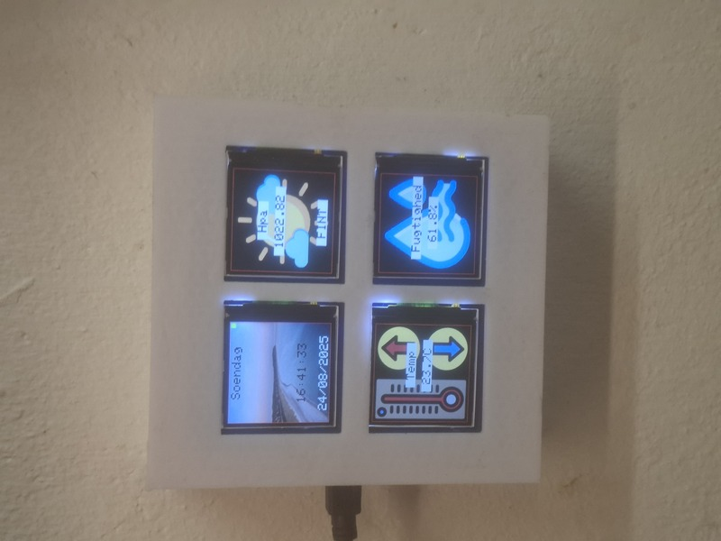
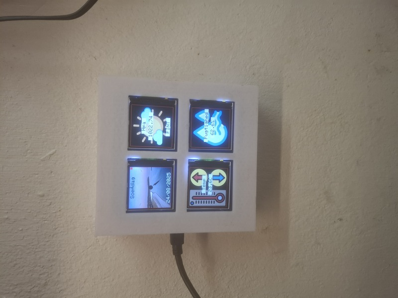
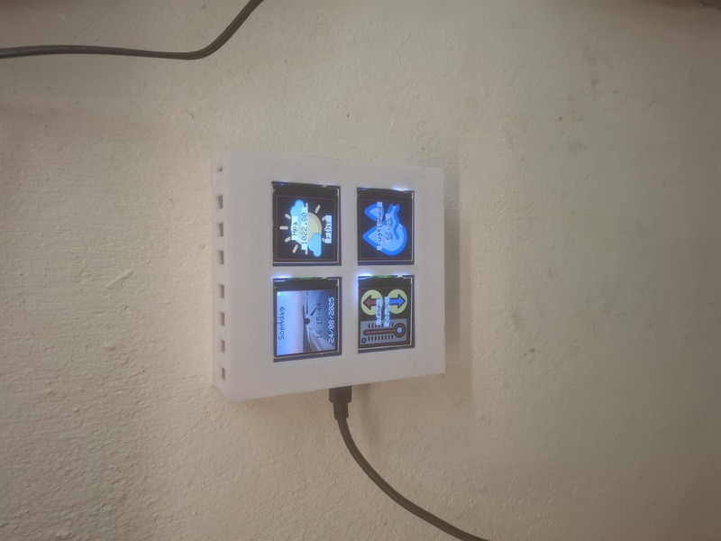

# SBComputer Pico 2x2 Display (RP2040 Pico, dual‑core)

Firmware for the SBComputer Pico 2x2 Display “2×2” wall device with 4× ST7789 240×240 TFT displays and a BME280 sensor.  
It shows humidity, temperature (compensated for self‑heating and backlight), pressure (hPa), and a clock with month backgrounds.  
A fast web UI lets you view status and adjust backlight and temperature calibration. Calibration values are stored on the SD card.


> <p align="center">
>   
>   
>   
> </p>

---

## Core split (RP2040 dual‑core)

- Core1: Owns SD card and all 4 TFTs. Draws UI and saves calibration.
- Core0: Owns BME280, RTC/DS3231 + NTP, WiFi + web server, and the auto‑calibration state machine.

The UI is highly responsive; the pressure category background can change immediately around 1018 hPa to “show off” speed (no hysteresis by default).

## Features

- Dual‑core drawing and IO for smooth and fast updates
- Pressure category backgrounds (from SD BMP files)
- Month backgrounds on the clock display (from SD BMP files)
- Temperature compensation model (self‑heating + backlight rise)
- Auto‑calibration flow (low CPU, Ticker‑based)
- Web UI for status, backlight, and calibration (manual and auto)
- Calibration persisted to `/calib.cfg` on SD and restored on boot
- Simple WiFi indicator tile on the clock display

---

## Clock display (how it works)

- Single rotation model
  - All four displays use the same rotation set by `#define TFT_ROT` (default 3).
  - The clock background buffer is kept in screen coordinates; sampling/restore is 1:1 (no extra rotation math).

- Month backgrounds (SD → RAM → TFT)
  - On month change, a 24‑bit BMP is loaded from SD into a static 240×240 RGB565 RAM buffer.
  - The buffer is drawn with `drawRGBBitmap` (Adafruit_GFX handles device rotation).
  - A red 1‑px border is drawn around the tile after each background.

- Pixel‑accurate background restore
  - Any overlay (text or analog hands) can restore its exact area from the RAM background.
  - If RAM copy is unavailable (rare), it falls back to restoring from SD using the cached BMP header.

- Text overlays (DOW, TIME, DATE)
  - DOW/DATE: Opaque text with adaptive background/foreground chosen from the underlying image area.
  - TIME: Transparent text over the restored original pixels (restore → print transparent). This guarantees the photo shows through exactly, with black/white text chosen for contrast.
  - You can switch DOW/DATE to transparent as well by following the same restore‑then‑print pattern (`drawCenteredTransparentOnClk` shows how).

- Analog clock (optional)
  - Controlled by `USE_ANALOG_CLOCK`:
    - `0`: text only (DOW + TIME + DATE)
    - `1`: analog only (DOW + DATE)
    - `2`: both (TIME drawn on top of hands every second)
  - Previous hand areas are restored from the RAM background each second, then hands are re‑drawn.
  - Hand colors are chosen per‑hand from local average luma (black/white) for best contrast.
  - Dial has 12 marks + 4 thicker quadrant marks; a center hub circle is filled last.
  - A small WiFi indicator square (top‑right) is green when connected, red otherwise.

---

## Hardware (Pico device)

- MCU: Raspberry Pi Pico (RP2040), Earle Philhower Arduino core
- Sensor: BME280 on I2C0 (addr 0x76)
  - SDA = GP20, SCL = GP21
- Displays: 4× ST7789 240×240
  - HUMIDITY (SPI1): CS=GP13, DC=GP12, SCK=GP10, MOSI=GP11
  - TEMP (SPI0 default): CS=GP28, DC=GP16, SCK=GP18, MOSI=GP19
  - HPA (SPI0 remap): CS=GP5,  DC=GP4,  SCK=GP2,  MOSI=GP3
  - CLOCK (SPI0 remap): CS=GP9, DC=GP8,  SCK=GP6,  MOSI=GP7
- SD card (SPI0 default): SCK=GP18, MOSI=GP19, MISO=GP16, CS=GP17 (25 MHz)
- Backlight PWM: GP14 (0..255)

Important: `TEMP_DC` (GP16) shares with SD MISO. Core1 dynamically remaps SPI0 between SD and the SPI0‑based TFTs so SD and TFTs can share the bus safely.

---

## Build Requirements

- Board support: Arduino‑Pico (Earle Philhower) for RP2040
- Libraries:
  - Adafruit_GFX
  - Adafruit_ST7789
  - Adafruit_BME280
  - RTClib
  - WiFi (CYW43) and WiFiUdp
  - NTPClient
  - SD
  - Ticker

Reference compile size (varies by toolchain):
- Sketch: ~604 kB of 2049 kB
- Globals: ~192 kB of 262 kB

---

## SD Card Layout

- WiFi config (optional; runs fine offline):
  - `/wifi.cfg`
    - `SSID=your_ssid`
    - `PASS=your_password`
- Calibration (created/updated by firmware):
  - `/calib.cfg`
    - `HEATK=<float>`   // fixed self‑heating at BL=0 (°C)
    - `BLCOMP=<float>`  // °C per PWM count (0..0.1)
- Images (24‑bit BMP, up to 240×240):
  - Pressure categories (HPA display):
    - `/img/thunder240.bmp`
    - `/img/regn240.bmp`
    - `/img/skyer240.bmp`
    - `/img/letteskyer240.bmp`
    - `/img/sol240.bmp`
  - Month backgrounds (1–12, clock display):
    - `/img/0240.bmp`, `/img/1240.bmp`, …, `/img/11240.bmp`
  - Humidity background (optional):
    - `/img/fugtighed240.bmp`

TEMP tile uses an embedded RGB565 image (`temp240.h`). If an image is missing, the UI falls back to text on white.

---

## Web Endpoints

- `/`                         HTML status + backlight control + link to calibration
- `/statusjson.htm`           JSON with current readings
- `/backlight?bl=0..255`      Set backlight PWM (0..255)
- `/calib`                    Calibration page (manual values + auto‑cal controls)
- `/calib.json`               JSON: heatk, bl255, blcomp
- Auto‑cal JSON/API:
  - `/auto_calib.json`
  - `/auto_calib_start?ref=<C>&dry=1|0`
  - `/auto_calib_cancel`
  - `/auto_calib_apply?save=1|0`

---

## Temperature Compensation

Model:
```
ambient = measured − (HEATK + backlightcomp × backlightPWM)
```

- `HEATK`: fixed offset at BL=0 (°C)
- `backlightcomp`: °C per PWM count (shown in the UI as “°C at 255”)
- Both parameters are persisted in `/calib.cfg`

Humidity is re‑expressed at ambient temperature using the Magnus formula so RH looks realistic despite sensor self‑heating.

---

## Auto‑Calibration (low‑CPU, Ticker‑driven)

Prereqs: 30 minutes since boot, stable environment, and a user‑provided reference temperature.

Flow:
1. Phase BL=0
   - Hold at least 10 minutes (max 20 min)
   - Ends early when 0.1 °C readings are stable for 3 consecutive samples
2. Phase BL=255
   - Same timing/stability criteria
3. Results:
   - `HEATK = max(0, T_bl0 − T_ref)`
   - `rise@255 = max(0, T_bl255 − T_bl0)` → internally, `backlightcomp = rise@255 / 255`
4. Dry‑run mode computes values without auto‑saving. You can then apply and optionally save.

Controls:
- Start: `/auto_calib_start?ref=<C>&dry=1|0`
- Cancel: `/auto_calib_cancel`
- Apply:  `/auto_calib_apply?save=1|0`
- Status: `/auto_calib.json` (also reflected on `/calib`)

---

## Pressure and Categories

The pressure (hPa) is offset‑corrected (`PRESS_OFFSET`) and mapped to a category to pick a background image:

- < 950: STORM
- < 983: REGN
- < 1018: USTADIGT
- < 1050: FINT
- ≥ 1050: MEGET FINT

By default there is no hysteresis/debounce, so near borders of hPa the background can flip frequently to demonstrate UI speed.

---

## Change display text to English

On‑screen strings are currently in Danish (e.g., “Fugtighed”, “Temp”, “Soendag”).  
Translate these helpers in `2x2_baro_clock.ino`:

- Tile labels: `drawHumidityLabel`, `drawTempLabel`, `drawHpaLabel`, `drawHpaState`
- Clock texts: `dowText`, `drawClockDOW`, `drawClockTime`, `drawClockDate`

Tip: TIME already uses a transparent overlay for perfect photo background.  
To make DOW/DATE transparent too, use the same “restore → transparent text” approach shown in `drawCenteredTransparentOnClk`.

---

## Quick Start

1) Prepare SD:
   - Optionally add `/wifi.cfg` if you want WiFi (format shown above)
   - Add the BMP images under `/img` (see lists above)
2) Flash the firmware and insert the SD card
3) Power up. Core1 initializes SD and displays; Core0 initializes the sensor, clock, WiFi, and web server
4) Optional: After a 30‑minute warm‑up, run auto‑cal (via `/calib`) and save results
5) Adjust backlight and mount on the wall

---

## Troubleshooting

- No WiFi? Check `/wifi.cfg` formatting. See serial logs for `[WiFi]` status and RSSI.
- SD not detected? Confirm wiring and that SPI0 remapping isn’t blocked by CS lines. The log prints “SD.begin FAILED” on failure.
- Temperature too high? Run auto‑cal and/or lower backlight.
- Pressure category flips too often? Add hysteresis/debounce in code (optional, not enabled by default).
- Wrong rotation? Set `#define TFT_ROT` to match your physical mounting (all four tiles use the same value).

---

## License

See repository license (if provided).  
If you intend this as an open project, consider adding an MIT license.

Made for the Tachyon device variant. Contributions and improvements are welcome!
